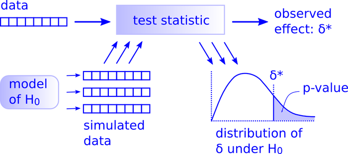

<!--
Schedule:
2019-09-30: In class midterm review
2019-10-02: Midterm due. class canceled 
2019-10-07: Finish BS. Introduce permutations (lecture 10) HW 4 is due. HW 5 is assigned.
2019-10-09: Further permutations (finish lecture 10)
2019-10-14: HW 5 is due. Tidyverse examples. 
2019-10-16 (family pictures): Final review (TAs handle the review)
2019-10-21: Last day of class; final exam due; class canceled

Possible R Moments:
- opencpu
- htmlwidgets
- RMarkdown
- h2o
- drake
- charlatan

#### 2018-10-18

*My God hath been my support; he hath led me through mine afflictions in the 
wilderness; and he hath preserved me upon the waters of the great deep. He hath 
filled me with his love, even unto the consuming of my flesh. He hath confounded 
mine enemies, unto the causing of them to quake before me.*

\- [2 Nephi 4:20-22](https://www.lds.org/scriptures/bofm/2-ne/4.20-22)

+ Announcements
  + Final exam starts tomorrow at 8am and is due Monday (2018-10-22) at 11:59pm
  + No class on Tuesday (2018-10-23)
+ R Moment: [Hands-On Programming with R](https://rstudio-education.github.io/hopr/index.html)
+ Intro to the [Tidyverse](https://www.tidyverse.org)

  + [Data sets](https://www.kaggle.com/datasets)
  + [NBA EDA](https://github.com/byu-stat-223/nba-players)
  + [Google Playstore EDA](https://github.com/byu-stat-223/google-playstore)

#### 2019-04-15

*Considering the Savior’s great promise for peace in this life and eternal life 
in the life to come, discipleship is a price worth paying. It is a price we cannot 
afford not to pay. By measure, the requirements of discipleship are much, much 
less than the promised blessings.*

\- James E. Faust ([GC October 2006](https://www.lds.org/general-conference/2006/10/discipleship?lang=eng){target="_blank"})

+ Announcements:
  + Final exam opens 6:00pm Today
    + Exam administered and submitted through RStudio Cloud
    + Open notes, open internet - not open neighbor
    + Due 11:59pm on Wednesday (2019-04-17)
    + No class on Wednesday (2019-04-17)
    + Plan on ~2-3 hours
+ R Moment: [rvest](https://rvest.tidyverse.org/index.html){target="_blank"}
+ [Practice Final](https://rstudio.cloud/spaces/12013/project/307411){target="_blank"}
+ Installing R and RStudio
  + [R](https://cran.r-project.org/){target="_blank}
  + [RStudio](https://www.rstudio.com/products/rstudio/download/#download){target="_blank}

#### 2019-12-09

*The Lord is with us, mindful of us and blessing us in ways only He can do.
Prayer can call down the strength and the revelation that we need to center our
thoughts on Jesus Christ and His atoning sacrifice. The Lord knew that at times
we would feel fear. I have been there and so have you, which is why the
scriptures are replete with the Lord’s counsel: “Be of good cheer, and do not
fear.”*

\- Ronald A. Rasband ([GC October
2018](https://www.lds.org/general-conference/2018/10/be-not-troubled?lang=eng){target="_blank"})

+ Announcements:
  + Final exam opens at 6:30pm today
    + Exam administered and submitted through RStudio Cloud
    + Open notes, open internet - not open neighbor
    + No class on Wednesday (2019-12-11)
    + Due 11:59pm on Wednesday (2019-12-11)
    + Plan on ~2-3 hours
+ R Moment: [Plumber](https://www.rplumber.io/){target="_blank"}
+ [Homework 5](https://rstudio.cloud/spaces/36306/project/664618){target="_blank"} Questions
+ [Enter the Tidyverse](https://www.tidyverse.org/){target="_blank"}

    

  + [Tidy Tuesday Data](https://github.com/rfordatascience/tidytuesday){target="_blank"}

#### 2019-12-04

*Considering the Savior’s great promise for peace in this life and eternal life 
in the life to come, discipleship is a price worth paying. It is a price we cannot 
afford not to pay. By measure, the requirements of discipleship are much, much 
less than the promised blessings.*

\- James E. Faust ([GC October 2006](https://www.lds.org/general-conference/2006/10/discipleship?lang=eng){target="_blank"})

+ Announcements:
  + Final exam opens 6:30pm Monday, 2019-12-09
    + Exam administered and submitted through RStudio Cloud
    + Open notes, open internet - not open neighbor
    + Due 11:59pm on Wednesday (2019-12-11)
    + Plan on ~2-3 hours
+ R Moment: [h2o](https://www.h2o.ai/){target="_blank"}
+ Midterm results:
  
+ [Homework 5](https://rstudio.cloud/spaces/36306/project/664618){target="_blank"} Questions
+ [Exam Review](https://rstudio.cloud/spaces/36306/project/664665){target="_blank"}
  + Exam 5: Movies
  + Exam 4: General Conference
  
  
#### 2020-02-12
- RStudio Connect / Quickstart R moment
- Midterm solutions / grades
- Tidyverse day

#### 2020-02-18
- Bootstrapping and permutation testing - relationship and comparison

#### 2020-02-19
- Tidy non-parametrics (infer package)

#### 2020-02-24
- Final exam review

#### 2020-02-26
- Class canceled for exam
-->

#### 2020-04-13 | [**Live Lecture (Zoom)**](https://byu.zoom.us/j/446827791){target="_blank"}

*Because the Restoration reaffirmed the foundational truth that God does work in
this world, we can hope, we should hope, even when facing the most
insurmountable odds. That is what the scripture meant when Abraham was able to
hope against hope — that is, he was able to believe in spite of every reason not
to believe — that he and Sarah could conceive a child when that seemed utterly
impossible.*

\- Jeffrey R. Holland ([GC April
2020](https://www.churchofjesuschrist.org/study/general-conference/2020/04/43holland?lang=eng){target="_blank"})

+ Announcements
  + Final exam
    + Exam administered and submitted through RStudio Cloud
    + Open notes, open internet - **not open neighbor**
    + Plan on ~2-3 hours
    + Exam opens after class today
    + Exam due 11:59pm on Wednesday (2020-04-15) (No late submissions accepted)
    + No class Wednesday (2020-04-15)
  * [HW 5 Solutions](https://rstudio.cloud/spaces/54745/project/996784){target="_blank"}
+ R Moment: [h2o](https://www.h2o.ai/){target="_blank"}
+ [Final Exam Review](https://rstudio.cloud/spaces/54745/project/996776){target="_blank"}

#### 2020-04-08 | [**Recorded Lecture**](https://byu.box.com/v/stat223-permutation-testing-2){target="_blank"}

*Because of the Resurrection, we know that these mortal deficiencies are only
temporary.*

\- Dallin H. Oaks ([GC April 2020](https://www.churchofjesuschrist.org/study/general-conference/2020/04/51oaks?lang=eng){target="_blank"})

+ Announcements
  + Final exam
    + Exam administered and submitted through RStudio Cloud
    + Open notes, open internet - **not open neighbor**
    + Plan on ~2-3 hours
    + Review in class Monday, April 13
    + Exam opens ~5:00pm on April 13
    + Exam due 11:59pm on Wednesday (2020-04-15) (No late submissions accepted)
    + No class Wednesday (2020-04-15)
+ R Moment: [RStudio Connect](https://rstudio.com/products/connect/){target="_blank"} & [RStudio Quickstart](https://rstudio.com/products/quickstart/){target="_blank"}
+ [Homework 5](https://rstudio.cloud/spaces/54745/project/996774){target="_blank"} Questions
+ [Midterm Solutions](https://rstudio.cloud/spaces/54745/project/1125063){target="_blank"}
+ Permutation Tests Continued
  + Faithful | [`10/l10_faithful.Rmd`](https://rstudio.cloud/spaces/54745/project/996769){target="_blank"}
+ Bootstrapping and Permutation Testing | [`11/l11_bs-perm-comparison.Rmd`](https://rstudio.cloud/spaces/54745/project/996769){target="_blank"}

#### 2020-04-06 | [**Recorded Lecture**](https://byu.box.com/v/stat223-permutation-testing){target="_blank"}

*No matter what kind of storm is battering us — regardless of whether there is a
solution to it or whether there’s an end in sight — there is only one refuge,
and it is the same for all types of storms. This single refuge provided by our
Heavenly Father is our Lord Jesus Christ and His Atonement.*

\- Ricardo P. Giménez ([GC April
2020](https://www.thechurchnews.com/leaders-and-ministry/2020-04-05/general-conference-april-2020-sunday-afternoon-session-elder-gimenez-179526){target="_blank"})

+ Announcements:
  + [Homework 4](https://rstudio.cloud/spaces/54745/project/996773){target="_blank"} due tonight at 11:59pm
  + Upcoming Schedule
  + Midterm solutions and discussion on Wednesday
+ R Moment: [Plumber](https://www.rplumber.io/){target="_blank"}
+ Introduction to [Permutation Tests](https://en.wikipedia.org/wiki/Resampling_(statistics)#Permutation_tests){target="_blank"}

+ [There is only one test](http://allendowney.blogspot.com/2016/06/there-is-still-only-one-test.html){target="_blank"}
  + Brothers | [`10/l10_brothers.Rmd`](https://rstudio.cloud/spaces/54745/project/996769){target="_blank"}
  + Faithful | [`10/l10_faithful.Rmd`](https://rstudio.cloud/spaces/54745/project/996769){target="_blank"}
  + GPA | [`10/l10_gpa.Rmd`](https://rstudio.cloud/spaces/54745/project/996769){target="_blank"}
+ [Homework 5](https://rstudio.cloud/spaces/54745/project/996774){target="_blank"} Assigned (Due 2020-04-13 at 11:59pm)

#### 2020-04-01 | [**Recorded Lecture**](https://byu.box.com/v/stat223-bootstrap-continued){target="_blank"}

*Chidi, here's the thing with stuff. You can look at a problem from every angle
and drive yourself crazy, but sometimes, you just gotta huck a Molotov cocktail
at a drone and see what happens... I mean, where I'm from, most things blow up
eventually. So I learned that when something dope comes along, you gotta lock it
down. If you're always frozen in fear and taking too long to think about what to
do, you'll miss your opportunity and maybe get sucked into the propeller of a
swamp boat.*

\- Jason Mendoza ([The Good Place S4
E09](https://en.wikipedia.org/wiki/The_Good_Place){target="_blank"})

+ Announcements
  + Grading for midterm is ongoing and will be discussed next week
  + Midterm solutions will be provided next week
+ R Moment: [goodshirt](https://github.com/adam-gruer/goodshirt){target="_blank"} and [bortles](https://github.com/adam-gruer/bortles){target="_blank"}
+ [Homework 4](https://rstudio.cloud/spaces/54745/project/996773){target="_blank"} Questions
+ Bootstrap Continued
  + Bootstrap coverage | [`09/l09_bs_coverage.Rmd`](https://rstudio.cloud/spaces/54745/project/996769){target="_blank"}
  + Bootstrap troubles | [`09/l09_bs_troubles.Rmd`](https://rstudio.cloud/spaces/54745/project/996769){target="_blank"}

#### 2020-03-30 | [**Recorded Lecture**](https://byu.box.com/s/1gqi8y0d39xu2fl4qe5idnpnnqay14f0){target="_blank"}

*...Alma noted, “Time only is measured unto men.” Because speed is a measure of
distance over time, if time becomes less relevant, so does speed. Thus, in
eternal things, such as our ongoing progress in becoming like God, direction is
more important than speed. In the long run, the direction we are headed matters
much more than the rate at which we are moving.*

\- Kevin J. Worthen ([BYU Devotional January 8,
2019](https://speeches.byu.edu/talks/kevin-j-worthen_knowing-who-you-are/){target="_blank"})

+ R Moment: [blogdown](https://bookdown.org/yihui/blogdown/){target="_blank"}
  + [rbind.io](https://support.rbind.io/about/)

+ Introduction to [Bootstrap](https://en.wikipedia.org/wiki/Bootstrapping_(statistics)){target="_blank"}

> "Bootstrapping is the practice of estimating properties of an estimator
(such as its variance) by measuring those properties when sampling from an
approximating distribution." -
[Wikipedia](https://en.wikipedia.org/wiki/Bootstrapping_(statistics)){target="_blank"}

+ Bootstrap confidence interval on mean | [`08/l08_mean.Rmd`](https://rstudio.cloud/spaces/54745/project/996769){target="_blank"}
+ Memory loss | [`08/l08_memory.Rmd`](https://rstudio.cloud/spaces/54745/project/996769){target="_blank"}
+ Confidence interval | [`08/l08_ci.Rmd`](https://rstudio.cloud/spaces/54745/project/996769){target="_blank"}
+ [Homework 4](https://rstudio.cloud/spaces/54745/project/996773){target="_blank"} is assigned (Due 2020-04-06 at 11:59pm)

#### 2020-03-23 | [**Recorded Lecture**](https://byu.box.com/s/sae8a2l44yyn9g2enu6f1bnsntbzb0af){target="_blank"}

*Within each one of us, regardless of our own unique circumstances, challenges,
and even mistakes we have made, there is currently an essence of the divine. It
is part of our nature—a part of who we are that does not change.*

\- Kevin J. Worthen ([BYU Devotional January 8, 2019](https://speeches.byu.edu/talks/kevin-j-worthen_knowing-who-you-are/){target="_blank"})

+ Announcements:
  + Midterm opens Wednesday at 12:00pm (noon) MST
    + Exam administered and submitted through RStudio Cloud
    + Open notes, open internet - **not open neighbor**
    + Due 11:59pm on Friday (2020-03-27) (No late submissions accepted)
    + Plan on ~2-3 hours
    + No class Wednesday (2020-03-27)
  + Homework 3 due Wednesday (2020-03-27) at 11:59pm
  + Homework 1-3 solutions will be made available prior to the exam
+ R Moment: [Local Interpretable Model-agnostic Explanations (lime)](https://github.com/thomasp85/lime){target="_blank"}
+ [Midterm Review](https://rstudio.cloud/spaces/54745/project/996775){target="_blank"}

#### 2020-03-18 | [**Recorded Lecture**](https://byu.box.com/s/an87psv7hh7obrhku60ohpdmsdvsahad){target="_blank"}

*Face your doubts. Master your fears. “Cast not away therefore your confidence.”
Stay the course and see the beauty of life unfold for you.*

\- Jeffrey R. Holland ([BYU Devotional March 2, 1999](https://speeches.byu.edu/talks/jeffrey-r-holland_cast-not-away-therefore-your-confidence/){target="_blank"})

+ R Moment: [cheatsheets](https://www.rstudio.com/resources/cheatsheets/){target="_blank"}
+ Announcements:
  + Virtual office hours
  + Term schedule
+ [Homework 2](https://rstudio.cloud/spaces/54745/project/996771){target="_blank"} Questions
+ Confidence Intervals | [`04/l04_ci.Rmd`](https://rstudio.cloud/spaces/54745/project/996769){target="_blank"}
+ Simulation study for simple linear regression | [`06/l06_regression.Rmd`](https://rstudio.cloud/spaces/54745/project/996769){target="_blank"}
+ [Homework 3](https://rstudio.cloud/spaces/54745/project/996772){target="_blank"} is assigned (Due 2020-03-25 at 11:59pm)

#### 2020-03-11

*... where does God’s light not seek to shine? What field of inquiry can stand
apart from questions of ultimate reality? Of divine love? Of God’s design in
creation and redemption? To paraphrase a modern revelation, which powerfully
echoes ancient ones, God’s light proceeds from His presence to fill the
immensity of space and is thereby in all things. Would we dare circumscribe that
light? An eminent scholar and Christian believer wrote this of faith and
scholarship: “Put most simply, for believers to be studying created things is to
be studying the works of Christ.” This insight hardly limits learning. It should
set it free.*

\- J. Spencer Fluhman ([BYU Devotional July 30,
2019](https://speeches.byu.edu/talks/j-spencer-fluhman/the-university-and-the-kingdom-of-god/){target="_blank"})

+ Announcements:
  + Homework Feedback
+ R Moment: [r2d3](https://rstudio.github.io/r2d3/){target="_blank"}
+ [Simulation Study Outline](sim-study-outline.html)
+ [Plotting Review](https://rstudio.cloud/spaces/54745/project/996780){target="_blank"}
+ The Central Limit Theorem |
[`03/l03_central_limit_theorem.Rmd`](https://rstudio.cloud/spaces/54745/project/996769){target="_blank"}
+ [Costume Party](https://rstudio.cloud/spaces/54745/project/996779){target="_blank"}

#### 2020-03-09

*Yes, you face challenges. But so does every generation. These are our days, and
we need to be faithful, not faithless. I testify that the Lord knows about our
challenges, and through the leadership of President Nelson, He is preparing us
to meet them.*

\- Stephen W. Owen ([GC October 2019](https://www.churchofjesuschrist.org/study/general-conference/2019/10/13owen?lang=eng){target="_blank"})

+ Announcements:
  + [Utah County R User Group](https://www.meetup.com/utah-county-rug){target="_blank"}
  + [Homework 1](https://rstudio.cloud/spaces/54745/project/996770){target="_blank"} due today at 11:59pm
+ R Moment: [Shiny](http://shiny.rstudio.com/){target="_blank"}
+ [Homework 1](https://rstudio.cloud/spaces/44710/project/816498){target="_blank"} questions
+ Assessing uncertainty in simulation studies | [`03/l03_flipping_coins.Rmd`](https://rstudio.cloud/spaces/54745/project/996769){target="_blank"}
+ The Central Limit Theorem | [`03/l03_central_limit_theorem.Rmd`](https://rstudio.cloud/spaces/54745/project/996769){target="_blank"}
+ [Plotting Review](https://rstudio.cloud/spaces/54745/project/996780){target="_blank"}
+ [Homework 2](https://rstudio.cloud/spaces/54745/project/996771){target="_blank"} is assigned (Due 2020-03-16 at 11:59pm)

#### 2020-03-04

*I testify that his intelligence is vastly superior in every field to the very 
brightest mortals in those fields and that his intellect in scope and truth far 
exceeds all human intellects. I thank him for encapsulating that exquisite mind 
in both perfect love and perfect humility. His brilliance is not the 
“catch-me-if-you-can” kind, but a pleading and patient, “Come, follow me.”*

\- Neal A. Maxwell ([GC April 1976](https://www.lds.org/general-conference/1976/04/jesus-of-nazareth-savior-and-king?lang=eng){target="_blank"})

+ Announcements
  + If you do not have access to course materials / assignments on RStudio
  Cloud, click
  [here](https://rstudio.cloud/spaces/54745/join?access_code=vXfSwTSMrsYrikBaaoNmkhsS%2BXK5oLwQXtl3R0Ij){target="_blank"}.
  If that doesn't work, send me an email and I'll make sure you have the
  appropriate access.
+ R Moment: [Tidyverse](https://www.tidyverse.org/){target="_blank"}
+ [Homework 1](https://rstudio.cloud/spaces/54745/project/996770){target="_blank"} Questions
+ Introduction to simulation studies:
  + "Simulation study" and "Monte Carlo study" are synonymous.
  + Represent a real-world process programatically in order to evaluate statistical
  properties
  + Uses include:
    + Describing distributions (e.g., mean, variance, quantiles).
    + Evaluating point estimators.
    + Evaluating confidence intervals.
    + Investigating the properties and performance of testing hypothesis procedures.
    + Checking the finite-sample statistical properties of estimators and testing 
    procedures that have been motivated through asymptotics.
    + and many others...
  + Especially useful when theoretical derivations are unavailable, difficult, 
    or intractable.
+ Flipping coins | [`02/l02_coins.Rmd`](https://rstudio.cloud/spaces/54745/project/996769){target="_blank"}

#### 2020-03-02

*He felt all that was sad, wicked, or bad,
All the pain we would ever know.
While His friends were asleep, He fought to keep
His promise made long ago.
Gethsemane. Jesus loves me,
So He went willingly to Gethsemane.*

\- Melanie Hoffman ([Gethsemane](https://www.lds.org/friend/2018/03/gethsemane?lang=eng){target="_blank"})

+ About me
+ [Course Syllabus](syllabus.html)
+ Course Schedule
  + Out of town:
    + April 6 - 8
+ Introduction to [RStudio Cloud](https://rstudio.cloud){target="_blank"}
  + Choose a First and Last Name that will allow you to be easily identified - this is how we match work in RStudio Cloud back to Learning Suite
  + Access the [course workspace](https://rstudio.cloud/spaces/54745/join?access_code=vXfSwTSMrsYrikBaaoNmkhsS%2BXK5oLwQXtl3R0Ij){target="_blank"}
  + All assignments **must** remain in the course workspace in order to be graded
+ Why R is awesome (Stat 123 Review) | [`01/l01_review.Rmd`](https://rstudio.cloud/spaces/54745/project/996769){target="_blank"}
+ [Homework 1](https://rstudio.cloud/spaces/54745/project/996770){target="_blank"} is assigned (Due 2020-03-09 at 11:59 pm)
